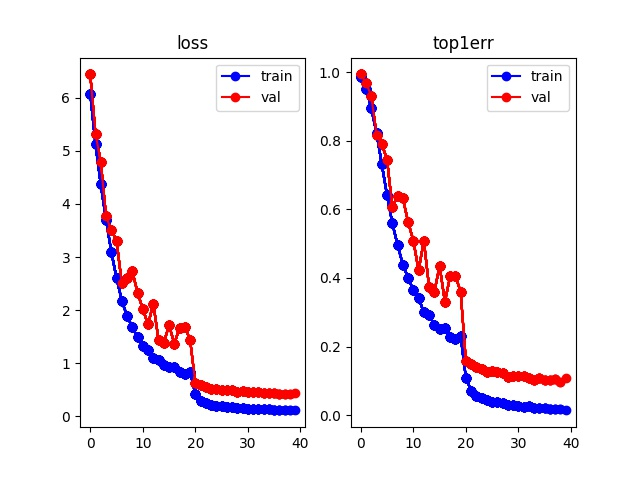

# Deep Sort with PyTorch

a graduation design which augment DeepSORT

---


## Dependencies

- python 3.9
- [requirements](requirements.txt)

## Quick Start

Check all dependencies installed

```bash
pip install -r requirements.txt
```

for user in china, you can specify pypi source to accelerate install like:

```bash
pip install -r requirements.txt -i https://pypi.tuna.tsinghua.edu.cn/simple
```

Download YOLOX-s weights yolox_s.pth

```
cd YOLOX/yolox_weights
# download yolox_s.path
cd ../../../
```

Download deepsort parameters ckpt.t7

```
cd DeepSORT/deep/checkpoint
# download ckpt.t7 from
https://drive.google.com/drive/folders/1xhG0kRH1EX5B9_Iz8gQJb7UNnn_riXi6 to this folder
cd ../../../
```

## [Optional] Use the third party submodules [fast-reid](https://github.com/JDAI-CV/fast-reid)

This library supports bagtricks, AGW and other mainstream ReID methods through providing an fast-reid adapter.

I have integrated the fastreid module to this project,
and you can read this [README.md](./fastreid/README.md) to get more detailed information.

Put weights files to `fastreid/reid_weights/`,
and refer to `configs/fastreid.yaml` for a sample of using fast-reid.

See [Fastreid Model Zoo](./fastreid/MODEL_ZOO.md) for more available methods and trained models.

## Run

```
usage: tracker.py 
                   [--fastreid]
                   [--config_fastreid CONFIG_FASTREID]
                   [--config_mmdetection CONFIG_MMDETECTION]
                   [--config_detection CONFIG_DETECTION]
                   [--config_deepsort CONFIG_DEEPSORT] 
                   [--display]
                   [--frame_interval FRAME_INTERVAL]
                   [--display_width DISPLAY_WIDTH]
                   [--display_height DISPLAY_HEIGHT] 
                   [--save_path SAVE_PATH]
                   [--cpu]
                   [--camera 0]
                   [--VIDEO_PATH /the path of video]       


# example for video
python tracker.py --VIDEO_PATH ./videos/MOT20-07.mp4 --display --save_result
# example for webcam
python tracker.py --camera 0 --display --save_result

```

Use `--display` to enable display.
Use `--fastreid` to enable fastreid.
Results will be saved to `./DeepSORT_outputs/`.

All files above can also be accessed from BaiduDisk!
linker：[BaiduDisk](https://pan.baidu.com/s/1wILNYJLxxZXEh0jSYt2_EQ)
passwd：7yzu

## Training the RE-ID model

The original model used in paper is in original_model.py, and its parameter here [original_ckpt.t7](https://drive.google.com/drive/folders/1xhG0kRH1EX5B9_Iz8gQJb7UNnn_riXi6).

To train the model, first you need download [Market1501](http://www.liangzheng.com.cn/Project/project_reid.html) dataset or [Mars](http://www.liangzheng.com.cn/Project/project_mars.html) dataset.

Then you can try [train.py](DeepSORT/deep/train.py) to train your own parameter and evaluate it using [test.py](DeepSORT/deep/test.py) and [evaluate.py](DeepSORT/deep/evalute.py).


## References

- paper: [Simple Online and Realtime Tracking with a Deep Association Metric](https://arxiv.org/abs/1703.07402)
- code: [nwojke/deep_sort](https://github.com/nwojke/deep_sort)
- code: [Megvii-BaseDetection/YOLOX](https://github.com/Megvii-BaseDetection/YOLOX)
